<!-- Generated by GitHub Profile Agent Console. Edit profile.config.json, then run npm run generate. -->

  <picture>
    <source media="(max-width: 760px) and (prefers-color-scheme: dark)" srcset="./assets/hero/agent-console-e72ad687-mobile-dark.svg">
    <source media="(max-width: 760px)" srcset="./assets/hero/agent-console-e72ad687-mobile-light.svg">
    <source media="(prefers-color-scheme: dark)" srcset="./assets/hero/agent-console-e72ad687-dark.svg">
    <source media="(prefers-color-scheme: light)" srcset="./assets/hero/agent-console-e72ad687-light.svg">
    
  </picture>

  

## About Me

Passionate full-stack developer from Portugal building modern web applications with cutting-edge technologies.

Experienced in React, Node.js, Next.js, and backend development. Committed to writing clean, scalable code.

Always learning and exploring new technologies. Open to collaborations on interesting projects.

## Current Focus

| Area | What I am exploring |
| --- | --- |
| **Web Development** | Building responsive and interactive web applications using React and Next.js |
| **Backend Development** | Creating robust APIs and services with Node.js and Python |
| **Database Design** | Designing and optimizing PostgreSQL databases for performance |

## Featured Work

| Project | Focus | Why it matters |
| --- | --- | --- |
| [**Portfolio**](https://github.com/Saintz324) | Full Stack Development | Personal portfolio showcasing full stack development projects and technical skills. |

## Research Direction

Focused on developing robust, scalable web applications using modern technologies. Interested in cloud-native development practices and building systems that can handle real-world challenges.

## Tech Stack

`React` · `Node.js` · `Next.js` · `JavaScript` · `Python` · `Java` · `PostgreSQL` · `C#`

---

  Building web applications that make a difference. Contact: onlyedu1@hotmail.com

